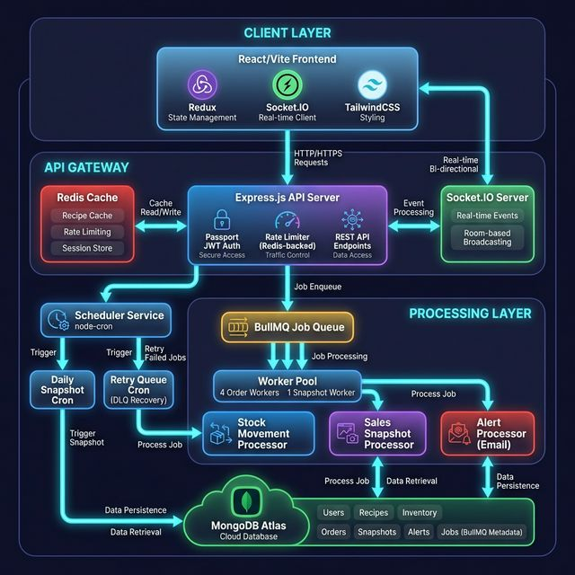
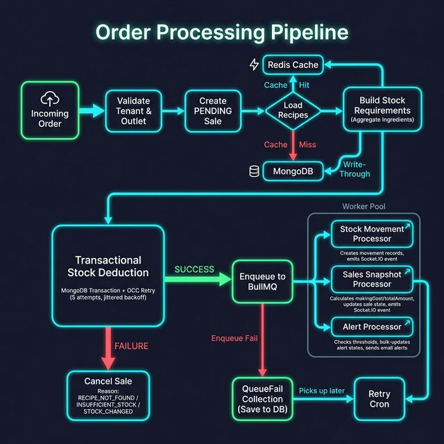
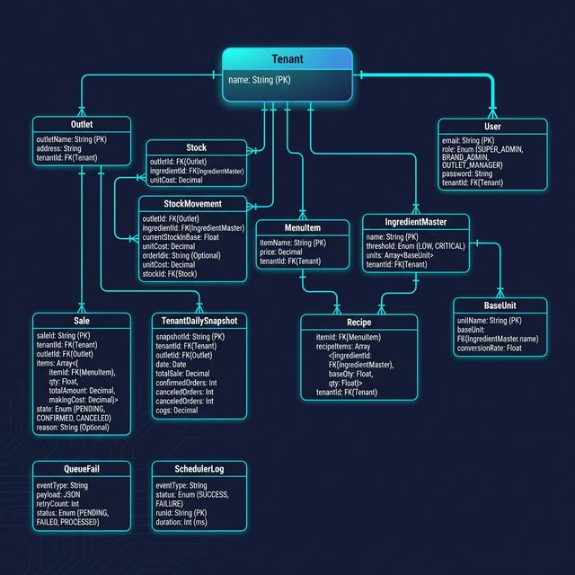
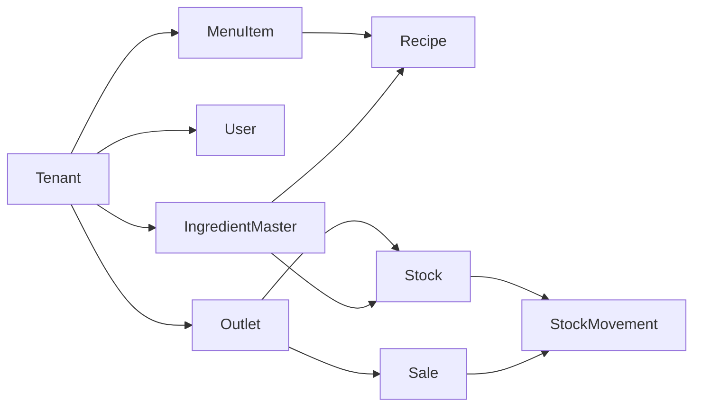

<p align="center">
  <h1 align="center">🍳 Smart Kitchen Inventory Intelligence (SKII)</h1>
  <p align="center">
    <strong>A production-grade, multi-tenant kitchen inventory management platform built for real-time order processing, intelligent stock tracking, and data-driven analytics.</strong>
  </p>
  <p align="center">
    
    
    
    
    
    
  </p>
</p>

---

## 📋 Table of Contents

- [Overview](#-overview)
- [System Architecture](#-system-architecture)
- [Order Processing Pipeline](#-order-processing-pipeline)
- [Tech Stack](#-tech-stack)
- [Data Model](#-data-model)
- [Why SKII is Scalable & Optimized](#-why-skii-is-scalable--optimized)
- [Key Features](#-key-features)
- [Project Structure](#-project-structure)
- [Getting Started](#-getting-started)

---

## 🧠 Overview

SKII is a **multi-tenant SaaS platform** designed for restaurant chains and cloud kitchens to manage inventory across multiple outlets in real-time. The system handles the entire lifecycle — from incoming orders to automatic stock deduction, intelligent low-stock alerting, and daily financial snapshot aggregation.

**The core problem it solves:** When an order comes in, the system must atomically deduct stock across multiple ingredients, calculate COGS (Cost of Goods Sold), detect low-stock thresholds, alert outlet managers, and update dashboards — all in real-time, at scale, without data inconsistency.

### Role-Based Multi-Tenant Architecture

| Role | Scope | Capabilities |
|------|-------|-------------|
| **Super Admin** | Platform-wide | Manage tenants (brands), global settings |
| **Brand Admin** | Single tenant | Manage outlets, menu items, ingredients, recipes, users |
| **Outlet Manager** | Single outlet | View stock, orders, analytics; receive alerts |

---

## 🏗 System Architecture

<p align="center">
  
</p>

The platform follows a **distributed, event-driven architecture** split across **5 independently scalable processes**:

| Process | Role | Scalability |
|---------|------|-------------|
| **API Server** | Handles HTTP requests, JWT auth, rate limiting | Horizontal (load-balanced) |
| **Worker Pool** | Processes async jobs from BullMQ queues | Horizontal (4 forked order workers) |
| **Snapshot Worker** | Processes daily aggregation jobs | Single instance, sequential |
| **Scheduler Service** | Cron-based job scheduling + DLQ retry | Single instance |
| **Client App** | React SPA with real-time Socket.IO | CDN-served, stateless |

### Communication Patterns

```
Client ←→ API Server     : REST + WebSocket (Socket.IO)
API Server → Redis        : Caching, Rate Limiting, Queue Backbone
API Server → BullMQ       : Async Job Dispatch
BullMQ → Worker Pool      : Job Processing (fan-out)
Worker → Socket.IO Server : Real-time Event Emission
Worker → MongoDB          : Data Persistence
Scheduler → BullMQ        : Scheduled + Retry Jobs
```

---

## 🔄 Order Processing Pipeline

<p align="center">
  
</p>

The order pipeline is the heart of the system. Here's the detailed flow:

### 1️⃣ Synchronous Phase (API Request)

```
Incoming Order → Validate Tenant & Outlet → Create PENDING Sale
    → Load Recipes (Redis cache-first, MongoDB fallback with write-through)
    → Build Stock Requirements (aggregate ingredients across all order items)
    → Transactional Stock Deduction (MongoDB session + OCC with 5 retries + jittered backoff)
```

### 2️⃣ Asynchronous Phase (Worker Pool)

Upon successful stock deduction, the job is enqueued to **BullMQ** and processed by the worker pool:

| Processor | Responsibility |
|-----------|---------------|
| **Stock Movement Processor** | Creates auditable movement records, emits `STOCK_MOVEMENT_CREATED` via Socket.IO |
| **Sales Snapshot Processor** | Calculates `totalAmount` and `makingCost` (COGS), updates sale state to `CONFIRMED`, emits `SALES_CREATED` |
| **Alert Processor** | Evaluates stock thresholds, bulk-updates alert states (`OK → LOW → CRITICAL`), sends email notifications to outlet managers |

### 3️⃣ Failure Handling

- **Transaction failure** → Sale is `CANCELED` with reason (`RECIPE_NOT_FOUND` / `INSUFFICIENT_STOCK` / `STOCK_CHANGED`)
- **Queue failure** → Payload saved to `QueueFail` collection (Dead Letter Queue)
- **Worker failure** → BullMQ retries (5 attempts, exponential backoff). Exhausted jobs → saved to DLQ
- **DLQ Recovery** → Retry cron picks up failed jobs every minute and re-enqueues them

---

## ⚙️ Tech Stack

### Backend

| Technology | Purpose |
|-----------|---------|
| **Node.js** | Runtime |
| **Express 5** | REST API framework |
| **MongoDB Atlas** | Primary database with transactions |
| **Mongoose 8** | ODM with compound indexes & aggregation pipelines |
| **Redis (ioredis)** | Caching, rate limiting, queue backbone |
| **BullMQ** | Distributed job queue with retry & DLQ |
| **Socket.IO** | Real-time bi-directional events |
| **Passport + JWT** | Stateless authentication |
| **express-rate-limit** | Tiered rate limiting (Redis-backed) |
| **node-cron** | Scheduled job orchestration |
| **Nodemailer** | Email alerts (stock thresholds, OTP) |
| **Multer + fast-csv** | CSV bulk upload & parsing |
| **bcrypt** | Password hashing |

### Frontend

| Technology | Purpose |
|-----------|---------|
| **React 19** | UI framework |
| **Vite 7** | Build tool & dev server |
| **Redux Toolkit (RTK Query)** | State management & API layer |
| **TailwindCSS 4** | Utility-first styling |
| **ShadCN/UI (Radix)** | Accessible component primitives |
| **Recharts** | Data visualization & analytics |
| **Socket.IO Client** | Real-time updates |
| **TanStack Table** | Data tables with sorting, filtering |
| **PapaParse** | Client-side CSV parsing & validation |
| **React Router v7** | SPA routing |

---

## 📊 Data Model

<p align="center">
  
</p>

### Collections Overview

The database is designed around **13 collections** with a **denormalized multi-tenant pattern** — tenant and outlet info is embedded in each document to enable **single-query reads** without `$lookup` joins.

| Collection | Purpose | Key Indexes |
|-----------|---------|-------------|
| **Tenant** | Restaurant brand/chain | `name` (unique) |
| **User** | Platform users with RBAC | `email` (unique) |
| **Outlet** | Physical restaurant locations | `(tenant.tenantId, createdAt)` |
| **IngredientMaster** | Master ingredient catalog with thresholds & unit conversions | `(tenant.tenantId, createdAt)` |
| **BaseUnit** | Unit of measurement definitions | `unitName` |
| **MenuItem** | Menu items with prices | `(tenant.tenantId, itemName)`, `(tenant.tenantId, createdAt)` |
| **Recipe** | Item-to-ingredient mapping with quantities | `(tenant.tenantId, item.itemId)` |
| **Stock** | Current stock levels per outlet per ingredient | `(outlet.outletId, masterIngredient.ingredientMasterId)` |
| **StockMovement** | Immutable audit log of all stock changes | `(tenant.tenantId, outlet.outletId, reason, createdAt)`, `(orderId, ingredient.ingredientMasterId)` |
| **Sale** | Order records with lifecycle states | `(tenant.tenantId, outlet.outletId, createdAt)`, `(tenant.tenantId, createdAt)` |
| **TenantDailySnapshot** | Pre-aggregated daily financial summaries | `(tenant.tenantId, date)` |
| **QueueFail** | Dead Letter Queue for failed async jobs | `eventType` |
| **SchedulerLog** | Cron execution audit trail | `eventType`, `runId` |

### Key Data Relationships



---

## 🚀 Why SKII is Scalable & Optimized

### 1. Asynchronous Event-Driven Processing

The API server and background processing are **completely decoupled** via BullMQ. This means:

- The API responds to the client in **~50ms** (synchronous stock deduction only)
- Heavy computation (COGS calculation, alert evaluation, movement logging, snapshots) happens **async in workers**
- Workers can be **horizontally scaled** — the system spawns **4 order worker processes** via `child_process.fork()`
- Each worker runs with **concurrency: 5**, handling up to **20 parallel jobs** across all workers

### 2. Optimistic Concurrency Control (OCC) with Retries

Stock deduction uses **MongoDB transactions** with an OCC pattern:

```javascript
// Atomic bulkWrite within a transaction
filter: {
  "outlet.outletId": outletId,
  "masterIngredient.ingredientMasterId": ingredientId,
  currentStockInBase: { $gte: requiredQty }  // guard clause
},
update: { $inc: { currentStockInBase: -requiredQty } }
```

- If a write conflict occurs (two concurrent orders deducting the same stock), the transaction is retried up to **5 times** with **jittered exponential backoff** (`20ms + random(80ms)`)
- This eliminates race conditions while avoiding pessimistic locks that would bottleneck throughput

### 3. Redis Cache-First Recipe Loading

Recipes are the most frequently accessed data during order processing. The system uses a **write-through cache strategy**:

```
Order comes in → Check Redis for all recipes (mget) → Cache HIT? Use cached
                                                   → Cache MISS? Load from MongoDB, write to Redis (TTL: 24h)
```

- **`mget`** loads all recipes in a **single round-trip** instead of N individual calls
- Cache invalidation uses **pattern-based `SCAN` deletion** when recipes are updated
- This reduces MongoDB query load by **~80%** for high-frequency order endpoints

### 4. Compound Indexes Aligned to Query Patterns

Every collection has **purpose-built compound indexes** that match exact query patterns:

| Query Pattern | Index |
|--------------|-------|
| Get stock for an outlet's ingredient | `(outlet.outletId, masterIngredient.ingredientMasterId)` |
| List sales for an outlet by date | `(tenant.tenantId, outlet.outletId, createdAt: -1)` |
| Find movement by order | `(orderId, ingredient.ingredientMasterId)` |
| Tenant-scoped date range queries | `(tenant.tenantId, createdAt: -1)` |
| Snapshot by tenant and date | `(tenant.tenantId, date)` |

This ensures **all queries use covered or indexed reads** — no full collection scans, even at scale.

### 5. Pre-Aggregated Daily Snapshots

Instead of running expensive aggregation pipelines on every analytics request, the system **pre-computes daily summaries**:

- A **cron job** runs at **01:00 IST daily** and enqueues a snapshot job
- The processor uses a **MongoDB aggregation pipeline** with `$dateTrunc` and `$group` across all tenants
- Results are **bulk-written** (upsert) into the `TenantDailySnapshot` collection inside an **atomic transaction**
- Gap-fill logic detects the last snapshot date and processes all missing days automatically

This converts **O(n) real-time aggregations** into **O(1) pre-computed lookups**.

### 6. Tiered Rate Limiting (Redis-Backed)

Three tiers of rate limiting protect the system from abuse:

| Tier | Window | Max Requests | Key Strategy |
|------|--------|-------------|-------------|
| **General** | 1 min | 100 | User ID (authenticated) or IP (anonymous) |
| **Authentication** | 10 min | 20 | IP-based |
| **CSV Upload** | 5 min | 5 | User ID or IP |

All rate limit counters are stored in **Redis** (via `rate-limit-redis`), enabling:
- **Distributed rate limiting** across multiple API server instances
- **Sliding window** accuracy with `resetExpiryOnChange`
- Zero memory burden on the application server

### 7. Idempotent Processors

Workers use `findOneAndUpdate` with `$setOnInsert` + `upsert: true`, making all operations **idempotent**:

```javascript
// If a job is retried, duplicate movements are NOT created
StockMovement.findOneAndUpdate(
  { orderId, "ingredient.ingredientMasterId": id, reason: "ORDER" },
  { $setOnInsert: { ...movementData } },
  { upsert: true }
)
```

This means BullMQ can safely retry failed jobs **without data duplication**.

### 8. Dead Letter Queue (DLQ) with Auto-Recovery

A two-layer failure recovery system ensures **no job is permanently lost**:

```
Layer 1: BullMQ Retry → 5 attempts, exponential backoff (1s, 2s, 4s, 8s, 16s)
Layer 2: QueueFail DLQ → Failed jobs saved to MongoDB → Retry cron re-enqueues every minute
```

- Jobs that exhaust BullMQ retries are saved to `QueueFail` with `status: "investigate"`
- The retry cron processes up to **50 pending DLQ entries per run** with mutex protection (`isRunning` flag)
- All scheduler executions are logged to `SchedulerLog` with duration, status, and error details

### 9. Denormalized Multi-Tenant Data Model

Instead of using MongoDB `$lookup` (equivalent to SQL JOINs), tenant and outlet information is **embedded** in every document:

```javascript
// Every document carries its tenant context
tenant: { tenantId: ObjectId, tenantName: String }
outlet: { outletId: ObjectId, outletName: String }
```

**Benefits:**
- **Single-query reads** — no joins needed for listing data
- **Compound indexes** work efficiently with embedded fields
- **Tenant isolation** is enforced at the query level in every controller
- Scales linearly with number of tenants without cross-collection pressure

### 10. Real-Time Socket.IO with Room-Based Broadcasting

Workers emit events directly to Socket.IO rooms, enabling **instant UI updates**:

```
Room Pattern: tenant:{tenantId}:outlet:{outletId}
Events: SALES_CREATED, STOCK_MOVEMENT_CREATED
```

- Socket connections are **JWT-authenticated** at the handshake level
- **Room authorization** prevents users from joining unauthorized tenants/outlets
- Workers connect via a **service auth bypass** (no cookie needed)

### 11. Parallel Pagination

The pagination utility runs **count and data queries in parallel** using `Promise.all`:

```javascript
const [totalDocs, data] = await Promise.all([
  model.countDocuments(filter),
  model.find(filter).sort(sort).skip(skip).limit(limit)
]);
```

This cuts pagination response time by **~40%** compared to sequential execution.

---

## ✨ Key Features

### Operations
- 📦 **Real-time Stock Tracking** — per ingredient, per outlet, with `OK / LOW / CRITICAL` alert states
- 🛒 **Order Processing** — atomic stock deduction with transactional guarantees
- 📊 **Stock Movement Audit** — immutable log of all purchases, orders, and adjustments
- ⚖️ **Weighted Average Cost (WAC)** — automatic unit cost recalculation on every purchase
- 📧 **Email Alerts** — automatic notification to outlet managers when stock drops below thresholds

### Menu Management
- 🍔 **Menu Items** — centralized menu with pricing
- 📝 **Recipes** — ingredient-to-item mapping with unit conversions
- 📤 **Bulk CSV Upload** — menu items, recipes, ingredients, and stock movements via CSV with client-side validation

### Analytics
- 📈 **Daily Snapshots** — pre-aggregated revenue, COGS, order counts per outlet
- 📉 **Live Dashboard** — real-time order and stock data via Socket.IO
- 📅 **Date Range Queries** — historical analytics with indexed time-series queries

### Platform
- 🏢 **Multi-Tenant** — complete data isolation per restaurant brand
- 👥 **Role-Based Access Control** — Super Admin, Brand Admin, Outlet Manager
- 🔐 **JWT + Passport Authentication** — stateless, cookie-based token management
- 🚦 **Tiered Rate Limiting** — Redis-backed, per-user/IP sliding window
- 🔄 **Real-time Updates** — Socket.IO with authenticated rooms

---

## 📁 Project Structure

```
InventoryManagementSystem/
├── client/                         # React 19 Frontend (Vite)
│   └── src/
│       ├── apps/                   # Role-based app shells
│       │   ├── super-admin/        # Platform management UI
│       │   ├── brand-admin/        # Tenant management UI
│       │   └── outlet-admin/       # Outlet operations UI
│       ├── components/             # Shared UI components (ShadCN)
│       │   ├── ui/                 # ShadCN/Radix primitives
│       │   ├── charts/             # Recharts visualizations
│       │   ├── side-bar/           # App navigation
│       │   └── common/             # CsvScanner, DataCards, etc.
│       ├── redux/                  # RTK Query API definitions
│       ├── sockets/                # Socket.IO client hooks
│       └── auth/                   # Auth guards & context
│
├── server/                         # Express 5 API Server
│   ├── app.js                      # Server entry point
│   └── src/
│       ├── controllers/            # 13 resource controllers
│       ├── models/                 # 13 Mongoose models
│       ├── routes/                 # REST API route definitions
│       ├── services/               # Business logic services
│       │   ├── cache.service.js    # Redis cache abstraction
│       │   ├── stockValidator.js   # Stock availability checker
│       │   └── stockRequirement.js # Recipe → ingredient aggregator
│       ├── queues/                 # BullMQ queue definitions
│       ├── workers/                # Background job workers
│       │   ├── startWorkers.js     # Process forking (4+1 workers)
│       │   ├── order.worker.js     # Order event processing
│       │   └── dailySnapshot.worker.js
│       ├── proccessors/            # Job processing logic
│       │   ├── stockMovement.processor.js
│       │   ├── salesSnapshot.processor.js
│       │   ├── dailySnapshot.processor.js
│       │   └── proccessAlerts.processor.js
│       ├── crons/                  # Scheduled jobs
│       │   ├── dailySnapshot.cron.js   # 01:00 IST daily
│       │   └── retryQueue.cron.js      # Every minute (DLQ)
│       ├── sockets/                # Socket.IO server setup
│       ├── middlerwares/           # Auth + Rate limiting
│       └── utils/                  # Helpers (pagination, email, etc.)
│
├── orders/                         # Order Simulator (Stress Testing)
│   └── index.js                    # Multi-outlet order generator
│
└── docs/                           # Architecture diagrams
```

---

## 🛠 Getting Started

### Prerequisites

- **Node.js** v20+
- **MongoDB Atlas** cluster (or local MongoDB with replica set for transactions)
- **Redis** instance (local or cloud like Upstash/Redis Cloud)

### 1. Clone the Repository

```bash
git clone https://github.com/Nischay2123/Smart-Kitchen-Inventory-Intelligence.git
cd Smart-Kitchen-Inventory-Intelligence
```

### 2. Server Setup

```bash
cd server
npm install
```

Create `.env`:
```env
PORT=8000
MONGO_URI=mongodb+srv://<user>:<pass>@cluster.mongodb.net/SKII
REDIS_URL=redis://default:<pass>@<host>:<port>
ACCESS_TOKEN_SECRET=your_jwt_secret
ACCESS_TOKEN_EXPIRY=7d
CLIENT_URL=http://localhost:5173
SMTP_HOST=smtp.gmail.com
SMTP_PORT=587
SMTP_USER=your-email@gmail.com
SMTP_PASS=your-app-password
```

Run all services:
```bash
# Terminal 1: API Server
npm run dev

# Terminal 2: Workers (4 order + 1 snapshot)
npm run start:worker

# Terminal 3: Scheduler (crons)
npm run start:scheduler
```

### 3. Client Setup

```bash
cd client
npm install
npm run dev
```

### 4. Stress Test (Optional)

```bash
cd orders
npm install
node index.js
```

This simulates concurrent orders across 5 outlets to validate the system under load.

---

<p align="center">
  <sub>Built with ❤️ by <a href="https://github.com/Nischay2123">Nischay Sharma</a></sub>
</p>